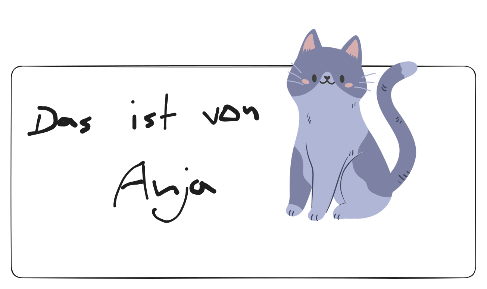

# Zwei-Faktor-Authentifizierung

Anscheinend gibt es hier auch eine automatische Rechtschreibprüfung, denn "Gifs" wird mir beim Schreiben rot unterstrichen. Die richtige Schreibweise ist GIFs. Eventuell ist es aber nur die Rechtschreibprüfung des Browsers.

## GIF:

<figure><figcaption><p>Rick Roll</p></figcaption></figure>

### Überschrift 2

#### Überschrift 3



Inhalt von Tab 1



Inhalt von Tab 2



* Diese Liste sollte kein Problem sein
* Ich baue sie trotzdem ein
* Sicherheitshalber


1. Diese Liste ist sortiert
2. Sie sollte auch keine Probleme darstellen
3. Coole Sache


* [ ] Das hier ist eine Task List
* [ ] Interessant
* [x] Wofür könnte man das gebrauchen?

***

Netter Divider

***

<details>

<summary>Das hier nennt sich <strong>Expandable</strong></summary>

Wenn ich draufklicke, wird dieser Inhalt expandiert.

[https://gitbook.com/docs/guides/product-guides/upload-and-embed-a-playable-video-into-your-gitbook-docs](https://gitbook.com/docs/guides/product-guides/upload-and-embed-a-playable-video-into-your-gitbook-docs)

Zwar kann ich GIFs und Bilder einbauen, aber Videos werden hier drin nur als Link angezeigt. Leider.


</details>

> Das hier ist ein nettes Zitat.
>
> Es kann auch mehrzeilig sein.

```
// Some code
```

#### Das hier ist eine Datei (kann runtergeladen werden):



#### Ein _embedded Video_ (get Rickrolled!):



#### Ein normaler Link:



#### Eine Tabelle:

| Table Head 1       | Table Head 2       | Table Head 3       |
| ------------------ | ------------------ | ------------------ |
| irgendein Inhalt 1 | irgendein Inhalt 2 | irgendein Inhalt 3 |
| irgendein Inhalt 4 | irgendein Inhalt 5 | irgendein Inhalt 6 |
| irgendein Inhalt 7 | irgendein Inhalt 8 | irgendein Inhalt 9 |

#### Ein Hinweis:


Das hier ist ein Hinweis


#### Karten:

<table data-view="cards"><thead><tr><th data-type="files"></th><th data-type="content-ref"></th><th data-hidden data-card-cover data-type="files"></th></tr></thead><tbody><tr><td></td><td><a href="https://de.freepik.com/freie-psd/kawaii-katzen-illustration_150887512.htm#fromView=keyword&#x26;page=1&#x26;position=48&#x26;uuid=d1d11a90-525f-4303-9a6e-3e9ec42cc739&#x26;from_element=images_trends&#x26;query=Katze">https://de.freepik.com/freie-psd/kawaii-katzen-illustration_150887512.htm#fromView=keyword&#x26;page=1&#x26;position=48&#x26;uuid=d1d11a90-525f-4303-9a6e-3e9ec42cc739&#x26;from_element=images_trends&#x26;query=Katze</a></td><td><a href="../.gitbook/assets/10478612.png">10478612.png</a></td></tr><tr><td></td><td><a href="https://de.freepik.com/freie-psd/kawaii-katzen-illustration_150887512.htm#fromView=keyword&#x26;page=1&#x26;position=48&#x26;uuid=d1d11a90-525f-4303-9a6e-3e9ec42cc739&#x26;from_element=images_trends&#x26;query=Katze">https://de.freepik.com/freie-psd/kawaii-katzen-illustration_150887512.htm#fromView=keyword&#x26;page=1&#x26;position=48&#x26;uuid=d1d11a90-525f-4303-9a6e-3e9ec42cc739&#x26;from_element=images_trends&#x26;query=Katze</a></td><td><a href="../.gitbook/assets/rickroll-roll.gif">rickroll-roll.gif</a></td></tr><tr><td></td><td></td><td><a href="../.gitbook/assets/10478612.png">10478612.png</a></td></tr></tbody></table>

#### Dies ist ein Editor, den wir für die Bearbeitung von Screenshots nutzen können:



#### Eine mathematische Formel:

$$
f(x) = x * e^{2 pi i \xi x}
$$

#### Link zu einer anderen Seite meiner Dokumentation:


[roxtra-einrichten.md](roxtra-einrichten.md)


#### Column content:



Was ist ein Column content?



Das ist ein Column content!


